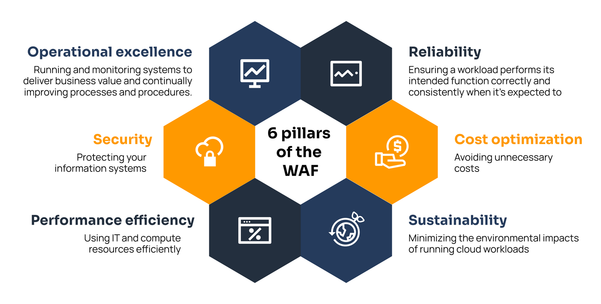

# Well-Architected Framework

Well-Architected Framework adalah Kerangka Kerja yang dapat membantu kita mengetahui kelebihan dan kekurangan dari keputusan yang kita ambil saat membuat sistem di AWS. Dengan menggunakan Kerangka Kerja ini, kita akan mengetahui praktik terbaik untuk mendesain dan mengoperasikan arsitektur sistem yang andal, aman, efisien, hemat biaya, dan ramah lingkungan di cloud.

Ada 6 Well-Architected Framework menurut AWS:

<figure><figcaption></figcaption></figure>

## Pilar Pertama: Operational Excellence

## Pilar Kedua: Security

## Pilar Ketiga: Reliability

## Pilar Keempat: Performance Efficiency

## Pilar Kelima: Cost Optimization

## Pilar Keenam: Sustainability
